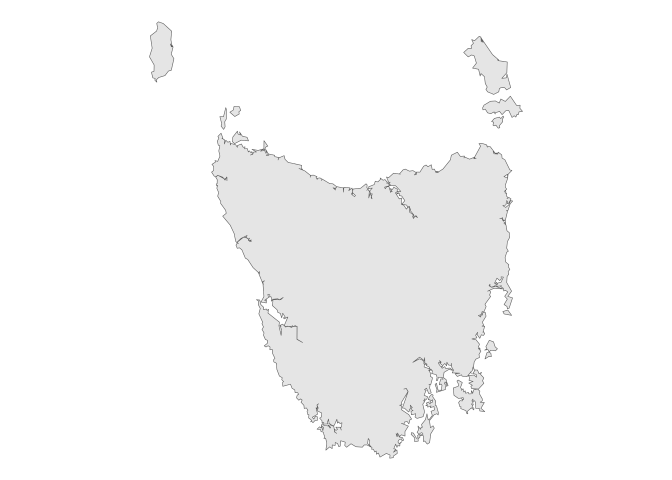
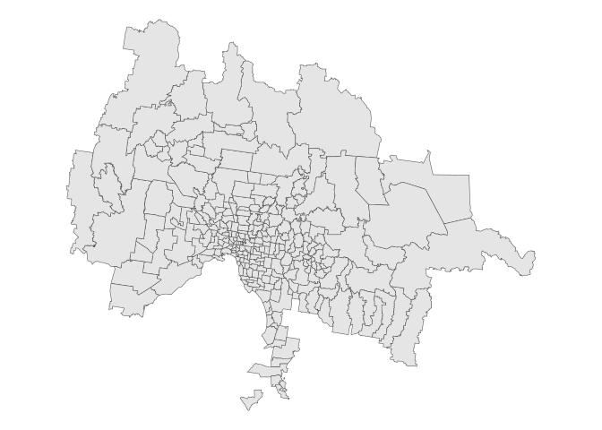

<!-- README.md is generated from README.Rmd. Please edit that file -->

# 📦 ozgs

<!-- badges: start -->

[](https://lifecycle.r-lib.org/articles/stages.html#experimental)
[](https://gardiners.r-universe.dev/ozgs)
[](https://github.com/gardiners/ozgs/actions/workflows/R-CMD-check.yaml)
<!-- badges: end -->

`ozgs` fetches and caches `sf` geometries and data from the [Australian
Statistical Geography
Standard](https://www.abs.gov.au/statistics/standards/australian-statistical-geography-standard-asgs-edition-3/jul2021-jun2026/access-and-downloads/data-services-and-apis)
(ASGS) web service.

## Installation

You can install the development version of `ozgs` from
[GitHub](https://github.com/) with:

``` r
# install.packages("devtools")
devtools::install_github("gardiners/ozgs")
```

Or from [r-universe](https://r-universe.dev) with:

``` r
install.packages('ozgs', repos = c('https://gardiners.r-universe.dev',
                                   'https://cloud.r-project.org'))
```

## Available geometries

Every geometry published by the ABS in every edition of the ASGS (1, 2
or 3) is currently available in `ozgs`.

These include the [Indigenous
Structure](https://www.abs.gov.au/statistics/standards/australian-statistical-geography-standard-asgs-edition-3/jul2021-jun2026/indigenous-structure),
[Statistical
Areas](https://www.abs.gov.au/statistics/standards/australian-statistical-geography-standard-asgs-edition-3/jul2021-jun2026/main-structure-and-greater-capital-city-statistical-areas)
(SA1, SA2, SA3 and SA4), [states and
territories](https://www.abs.gov.au/statistics/standards/australian-statistical-geography-standard-asgs-edition-3/jul2021-jun2026/main-structure-and-greater-capital-city-statistical-areas/australia-and-stateterritory),
[postcode
approximations](https://www.abs.gov.au/statistics/standards/australian-statistical-geography-standard-asgs-edition-3/jul2021-jun2026/non-abs-structures/postal-areas)
(POAs), [suburbs and
localities](https://www.abs.gov.au/statistics/standards/australian-statistical-geography-standard-asgs-edition-3/jul2021-jun2026/non-abs-structures/suburbs-and-localities),
[local government
areas](https://www.abs.gov.au/statistics/standards/australian-statistical-geography-standard-asgs-edition-3/jul2021-jun2026/non-abs-structures/local-government-areas)
(LGAs),
[state](https://www.abs.gov.au/statistics/standards/australian-statistical-geography-standard-asgs-edition-3/jul2021-jun2026/non-abs-structures/state-electoral-divisions)
and
[federal](https://www.abs.gov.au/statistics/standards/australian-statistical-geography-standard-asgs-edition-3/jul2021-jun2026/non-abs-structures/commonwealth-electoral-divisions)
electoral divisions, the [Remoteness
Structure](https://www.abs.gov.au/statistics/standards/australian-statistical-geography-standard-asgs-edition-3/jul2021-jun2026/remoteness-structure)
and the [mesh
blocks](https://www.abs.gov.au/statistics/standards/australian-statistical-geography-standard-asgs-edition-3/jul2021-jun2026/main-structure-and-greater-capital-city-statistical-areas/mesh-blocks)
from which each of these are constructed.

## Caching

Requests are cached to avoid repeatedly fetching data from the ABS
servers. By default, `ozgs` creates a simple memory cache using
`cachem::cache_mem()`, which persists for your current R session. To
persistently store ASGS geometries locally (or elsewhere), you can use
any `cachem`-compatible cache function.

## Usage examples

Get Tasmania’s boundaries from the STE (State and Territory) geography
defined in the 1st edition of the ASGS:

``` r
library(ozgs)
library(ggplot2)

tas <- ste("Tasmania", edition = 1)

theme_set(theme_void())
ggplot(tas) +
  geom_sf()
```



Get every postcode in Greater Melbourne:

``` r
melbourne_gccsa <- gccsa("Greater Melbourne", edition = 3)
melbourne_poa <- poa(edition = 3, filter_geom = melbourne_gccsa$geometry)
#> ! `filter_geom` cannot be a "MULTIPOLYGON" geometry.
#> ℹ Using `sf::st_union()` and `sf::st_cast()` to create a "POLYGON" for
#>   `filter_geom`.

ggplot(melbourne_poa) +
  geom_sf()
```



You can store cached geometries within your working directory for reuse
in other sessions. This is especially helpful if you’re working in
[RMarkdown](https://rmarkdown.rstudio.com/) or
[Quarto](https://quarto.org/docs/computations/r.html), which start a
fresh session on each render.

``` r
project_cache <- cachem::cache_disk("./readme_cache")
aus <- get_geography("AUS", edition = 3, cache = project_cache)
```

Or, set `ozgs.cache` as an option for use everywhere in your R script,
with the same effect:

``` r
options("ozgs.cache" = cachem::cache_disk("./readme_cache"))
aus <- get_geography("AUS", edition = 3)
```
